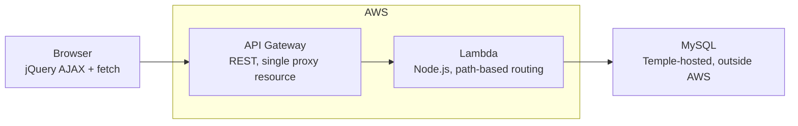
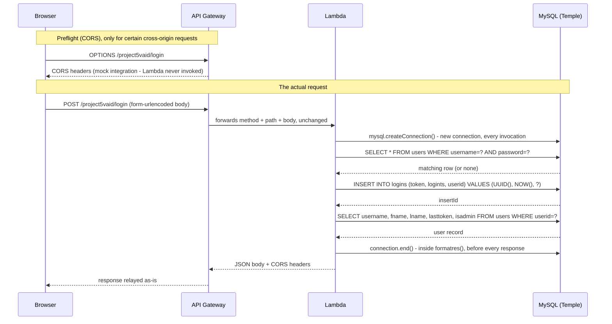
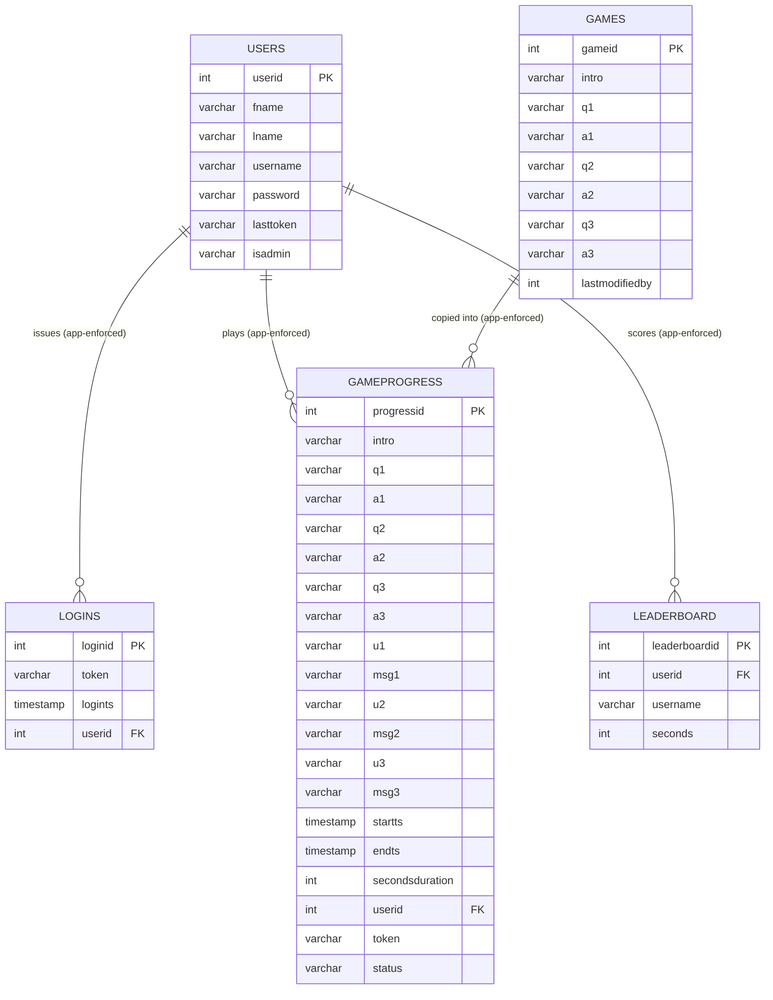

# Architecture

This document describes how a request actually moves through the system, the real database
schema, and the deployment boundary - the "how," building on the context in
[`BUSINESS_CASE.md`](BUSINESS_CASE.md). For a critique of specific decisions (what's fragile,
what's solid, what should change), see [`CODE_REVIEW.md`](CODE_REVIEW.md) - this document
stays descriptive.

## Deployment boundary

Only API Gateway and Lambda are AWS-managed. The database is Temple University's own
infrastructure, reached over the public internet - not an RDS instance inside the same account.



## Request lifecycle

Every request follows the same shape. Login is shown here as the representative example - every
other route (`signup`, `startgame`, `guess1`/`2`/`3`, `endgame`, `cancelgame`, `leaderboard`)
follows the identical pattern, just with different SQL.



## API Gateway configuration

A single REST API with a greedy proxy resource, not one manually-created resource per route:

```
/
  /project5vaid          <- ANY, OPTIONS
    /{proxy+}             <- ANY, OPTIONS
```

`{proxy+}` matches any path under `/project5vaid/`, and `ANY` matches every HTTP method - both
forward straight through to the Lambda with the real method and path attached, and the Lambda's
own routing function (below) does the actual dispatch. Two Lambda trigger permissions exist
(one for the base resource, one for everything under it) because API Gateway grants invocation
permission per matching resource pattern, not once per Lambda.

CORS is handled in two separate places that both have to agree:
- **Preflight `OPTIONS` requests** are answered directly by API Gateway's mock integration on
  `/{proxy+}` - the Lambda is never invoked for these.
- **Actual GET/POST/PATCH/DELETE responses** carry `Access-Control-Allow-Origin` set manually
  inside the Lambda's own response object, in `handler()`.

## Routing inside the Lambda

`handler()` parses `httpMethod` and `path` from the incoming event, then hands both to
`myRoutingFunction()`, which dispatches via a sequential `if` chain:

| Method | Path | Handler | Purpose |
|---|---|---|---|
| GET | *(empty)* | `features` list | Default response - API self-documentation |
| GET | `datetime` | `theDatetimeFunction` | Template example function |
| GET | `myname` | `myName` | Template example function |
| GET | `debugusers` / `debuglogins` / `debuggames` / `debuggameprogress` / `debugleaderboard` | `getUsers`, `getLogins`, etc. | Full unfiltered table dumps, for development/debugging |
| POST | `login` | `postLogin` | Validates credentials, issues a new token |
| POST | `signup` | `signup` | Creates a new user row |
| POST | `startgame` | `startGame` | Selects a hunt from `games`, creates or resets a `gameprogress` row |
| PATCH | `guess1` / `guess2` / `guess3` | `guess1`, `guess2`, `guess3` | Checks one answer, records the result |
| POST | `endgame` | `endgame` | Verifies all three answers correct, records time, writes to `leaderboard` |
| DELETE | `cancelgame` | `cancelGame` | Deletes the active `gameprogress` and `logins` rows for the token |
| GET | `leaderboard` | `getLeaderboardTop5` | Top 5 fastest completions |

## Connection lifecycle

A new MySQL connection is opened in `handler()` at the start of every single invocation, and
explicitly closed inside `formatres()` before every response is returned - there is no
connection pooling and no reuse across requests. This pattern comes from the course-provided
template (see `BUSINESS_CASE.md`), not from application-level code written for this project.

## Data model

Five tables, confirmed directly against `information_schema` and cross-checked against a MySQL
Workbench reverse-engineer of the live schema.



**Important:** none of these tables have a declared `FOREIGN KEY` constraint at the database
level. Every relationship shown above is real and consistently used across every query, but is
enforced entirely by application logic - confirmed by querying `information_schema.columns`
directly and by reverse-engineering the schema in MySQL Workbench, which draws all five tables
with no connecting lines for exactly this reason.

`games` contained exactly one populated row for the life of this project. The `ORDER BY RAND()
LIMIT 1` selection in `startGame` is correct and would select genuinely at random across
multiple hunts if more rows existed - it simply never had more than one option available.

## Authentication model

A UUID token is generated on successful login (`INSERT INTO logins (token, ...) VALUES
(UUID(), ...)`), written to both `logins.token` and `users.lasttoken`, and stored client-side in
`localStorage`. Every subsequent request that needs to identify the player includes this token
in its body or query string. Tokens are never expired or rotated - they remain valid until a
player explicitly ends or cancels a game, which nulls `users.lasttoken`.
